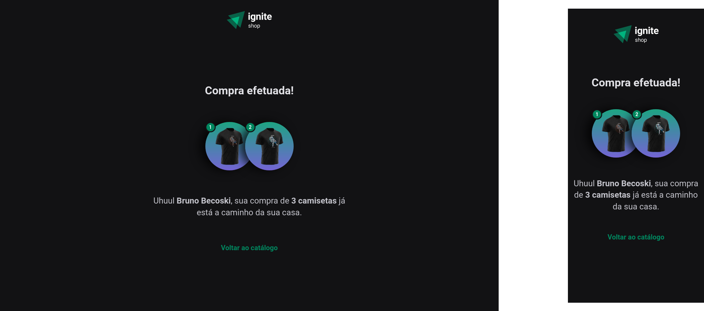

<h1 align="center">
  
</h1>

  

## ✨ Tecnologias

Esse projeto foi desenvolvido com as seguintes tecnologias:

- [Next.js](https://nextjs.org)
- [Stripe](https://stripe.com)
- [ReactJS](https://reactjs.org)
- [TypeScript](https://www.typescriptlang.org/)
- [Stitches](https://stitches.dev)

## 🖼️ Layout

### Home

  

### Product

   

### Cart

   

### Success

   

